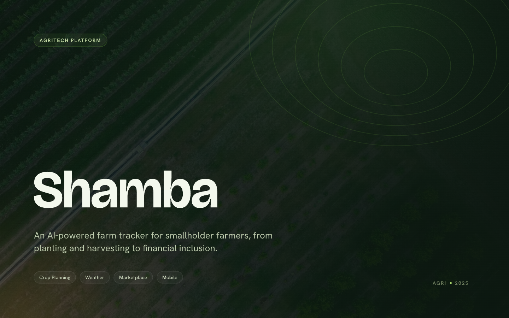
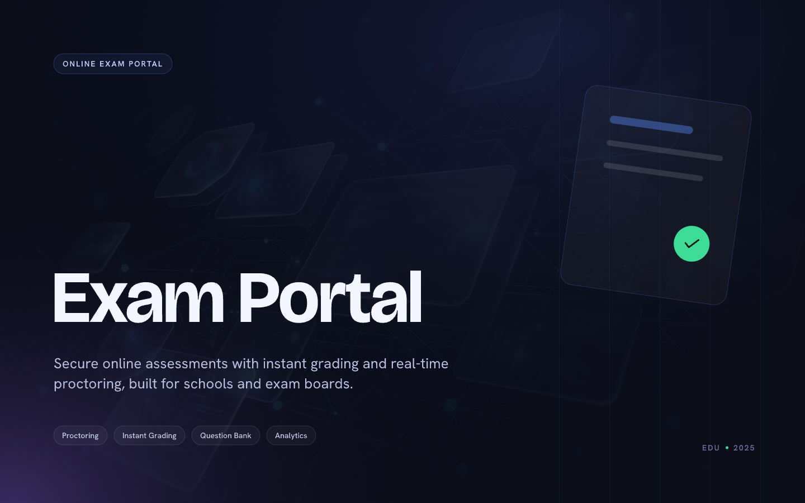

# 🧬 Derrick Arhin-Bannerman

**`Software Engineer & Systems Thinker`**

I'm a software engineer and founder building from Accra — products that solve real problems for real people, in the conditions they'll actually be used in. I find the problem before I write the first line. Turning complex systems into tools that actually work for the people using them.

  
  
  
  

---

## About Me

- I design and build solutions that bridge the gap between a user and their end goal.
- Currently building **Shamba** — an AI-powered farm activity tracker for smallholder farmers across sub-Saharan Africa.
- Technology Consultant at **Sarks Industries**, advising on digital infrastructure and AI adoption across a network of farms and export operations.

---

## 🧰 Tech Stack

**Extended stack:** OpenAI API · RAG pipelines · Multi-agent AI systems · AI bot development · Pencil (design) · Prompt Engineering · Vercel · Expo

---

## 🏺 Projects

<table>
  <tr>
    <td align="center" width="33%">
      
        
      <b>Shamba — AI Farm Activity Tracker</b> 
      AI-powered farm activity tracker for smallholder farmers across sub-Saharan Africa. AI insights, activity logging, and PDF record generation for financial institutions.  
      🔗 <a href="https://derrick-arhin-bannerman.vercel.app/work/shamba">Case Study</a>
        
      React Native · Python · FastAPI · OpenAI API · Firebase
    </td>
    <td align="center" width="33%">
      
        
      <b>Exam Portal — Secure Examination Platform</b> 
      A secure, scalable exam platform for academic institutions. Handles paper distribution, timed submissions, and result management end to end.  
      🔗 <a href="https://raw.githubusercontent.com/GruffGiant19/GruffGiant19/main/assets/exam-portal-preview.png">Case Study</a>
        
      Next.js · TypeScript · Supabase · PostgreSQL
    </td>
    <td align="center" width="33%">
      
        
      <b>Taxbot Ghana — Tax Regulation Assistant</b> 
      RAG-powered chatbot helping Ghanaian MSMEs navigate tax regulation and access tax information. Built on a custom knowledge base.  
      🔗 <a href="https://github.com/GruffGiant19/Taxbot-Ghana-with-RAG">Repo</a> &nbsp;·&nbsp; <a href="https://taxbot-ghana.vercel.app/">Live Site</a>
        
      OpenAI API · RAG · Python · Vercel
    </td>
  </tr>
</table>

---

_The problem comes before the code. Always._
